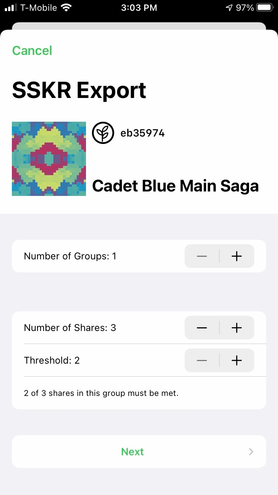
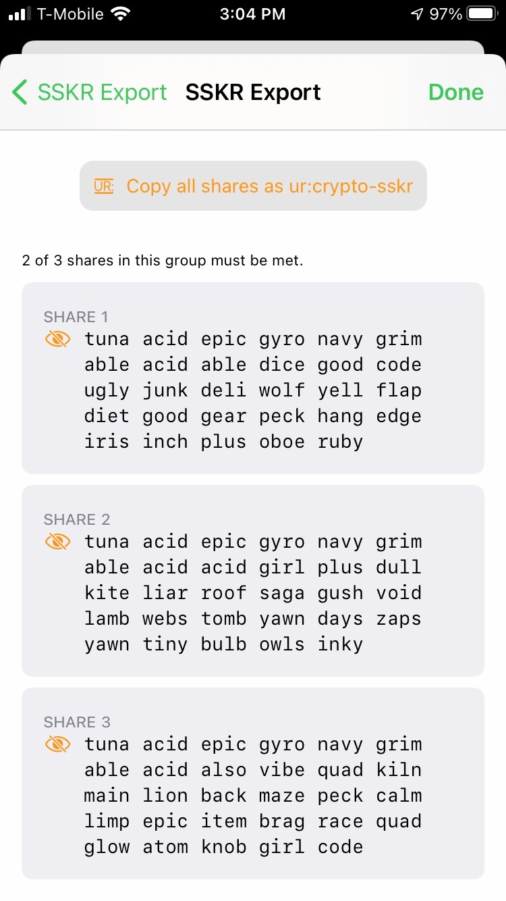
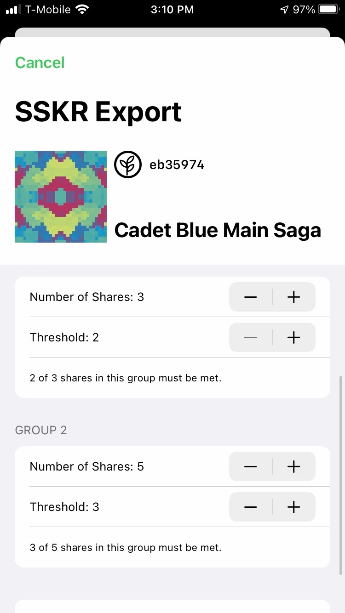
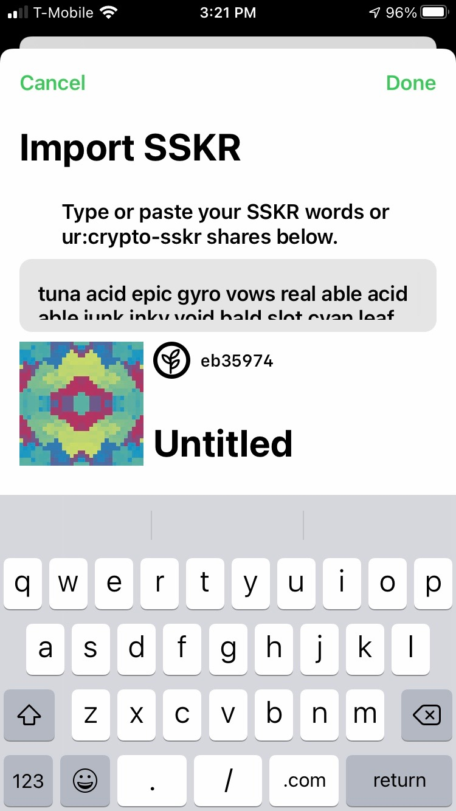

# SSKR for Users

SSKR is Sharded Secret Key Reconstruction. It's a way that you can break up the master seed underlying a Bitcoin HD wallet into "shares", which you can then distribute to friends, family, or fiduciaries. If you ever lose your seed, you can then "reconstruct" it by collecting sufficient of your shares (the "threshold").

## How Does SSKR Work?

The basic level of SSKR allows you to create a single group of shares, with a threshold for how many of those must be collected to reconstruct your seed. The following shows an example from [Gordian Guardian](https://github.com/BlockchainCommons/GordianGuardian-iOS) of creating three shares, of which two must be recovered.

<table width="100%" align="center">
  <tr>
    <Td>
      
    </td>
    <td>
      
    </td>
  </tr>
</table>

You would take these shares and give one each to three different trusted people (or places, such as a safe or bank vault).

Note the overlap in words in different shares: this is expected. The first four words ("tuna acid epic gyro") will always be the same as they describe the share as SSKR of a specific length. The next two ("navy grim") match all the shares in a split, and the next two ("able acid") all the shares in a group. 

Note also that your words will change each time you regenerate SSKR shares from a secret. This is also expected: there is a random factor in SSKR generation.

## How Does Advanced SSKR Work?

SSKR supports a more advanced methodology where you can define multiple groups, and then require a certain number of shares to come back from each group for a certain number of groups.

The following shows an example from [Gordian Guardian](https://github.com/BlockchainCommons/GordianGuardian-iOS) where either 2 of 3 shares must come back from the first group or 3 of 5 shares must come back from the second group. (If the group threshold was increased to 2, then those _both_ would be required.)

<table width="100%" align="center">
  <tr>
    <Td>
      
    </td>
    <td>
      
    </td>
  </tr>
</table>

This can allow for more complex scenarios, such as a business that hands off one set of shares to Chief Officers, and then backs that up with a set of shares held by their accountants or some other fiduciary.

Once you generate advanced SSKR shares, you would distribute them just like basic SSKR shares, but here being very careful to understand the roles of everyone you're giving shares to, since you're creating a more complex procedure.

## How Can I Record my SSKR Shares?

You can record an SSKR share by storing the ByteWords in a safe and recoverable form. We suggest [etching it in steel or titanium](https://github.com/BlockchainCommons/SmartCustodyBook/blob/master/manuscript/02-scenario.md#optional-step-use-metal-alternative-single-metal-tile--engraver) and have documented [a full example of a cold storage scenario](https://hackmd.io/8SEy7aZbTjCG0mJQI6N5zg).

Technically, you don't need to record every word: the first four words can be removed if you know that you're recording an SSKR of a specific length, and the last four can be removed as they're checksums. If that makes you more likely to record your ByteWords, then do so. But it's always better to record the whole thing to have the complete, self-describing information about your share.

## How Can I Reconstruct from SSKR?

SSKR-compliant wallet tools should allow you to paste in your SSKR and reconstruct your seed, as shown in the following example for [Gordian Guardian](https://github.com/BlockchainCommons/GordianGuardian-iOS)

<table width="100%" align="center">
  <tr>
    <Td>
      
    </td>
  </tr>
</table>

From there, your seed should be reconstructed and ready to go!

## Why Would I Use SSKR?

SSKR provides resilience for your keys. If you lose your master seed, you can then reconstruct it by recovering the threshold number of shares (or in the case of an advanced scenario, the threshold number of shares from the threshold number of groups).

SSKR simultaneously provides security. Because a number of shares must be combined to reconstruct a key, no individual could steal your digital assets; instead, a number would have to collude to do so, and you can design an SSKR scenario that makes that unlikely.

There is one caveat to using SSKR:

> _**WARNING.**_ The machine where you are reconstructing your key can be a vulnerability because your whole key is available at that location.

For that reason, we generally suggest [multisig](https://github.com/BlockchainCommons/Gordian/blob/master/Docs/Multisig.md) as a superior [#SmartCustody tool](https://www.smartcustody.com/). Nonetheless, we recognize that many people still use single-signature addresses, and for those situations, SSKR is an excellent tool for protecting your funds.

## Where is SSKR Available?

Though the examples here demonstrate SSKR with Gordian Guardian, SSKR is a Blockchain Commons specification that we are making available to wallet manufacturers. We expect to see it become widely used in other products.

## What is the Foundation of SSKR?

SSKR is the end-result of over two years of effort. It most immediately grew out of workgroups at the Rebooting the Web of Trust design workshops. At [RWOT8 in Barcelona](https://github.com/WebOfTrustInfo/rwot8-barcelona), a group of experts worked on "Shamir's Secret Sharing Best Practices" and the foundation of a new library, while at [RWOT9 in Prague](https://github.com/WebOfTrustInfo/rwot9-prague), a new cohort further discussed use cases, formats, and the two-level scheme. These workgroups included experts such as Christopher Allen, Bryan Bishop, Laurence Chen, Hank Chiu, Mark Friedenbach, Chris Howe, Yancy Ribbens, Daan Sprenkels, ChiaWei Tang, and  others. Initial work on Blockchain Common's `bc-shamir` library grew from Daan's work on his own [sss library](https://github.com/dsprenkels/sss). Further encouragement to produce the new SSKR specification came from Ken Sedgwick, who identified the round-tripping problems between BIP-39 and SLIP-39.
