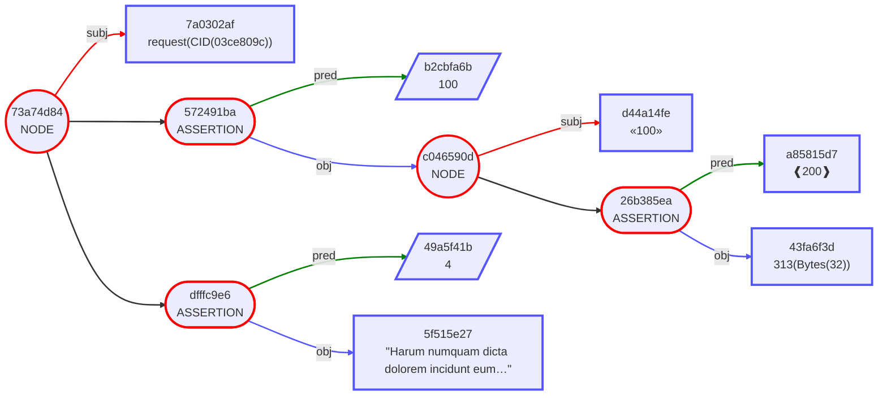
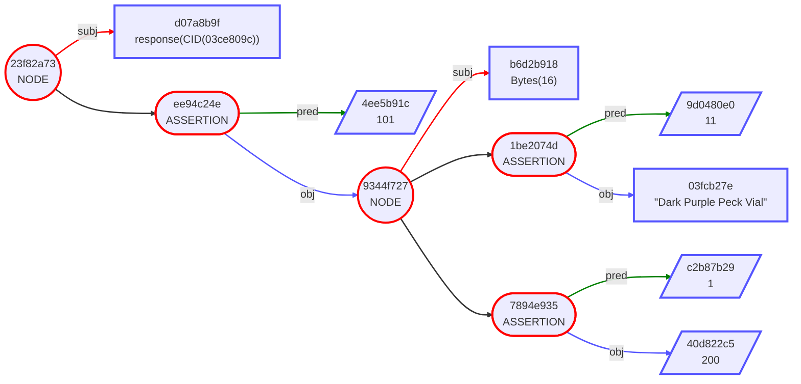
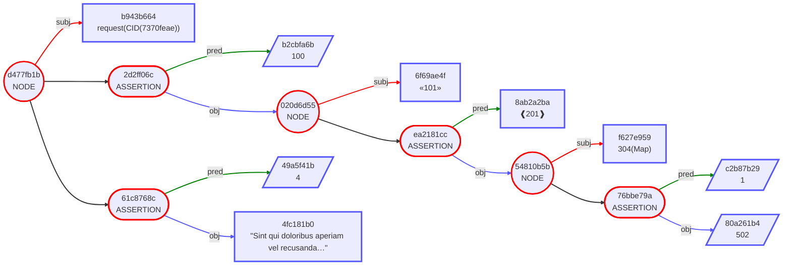
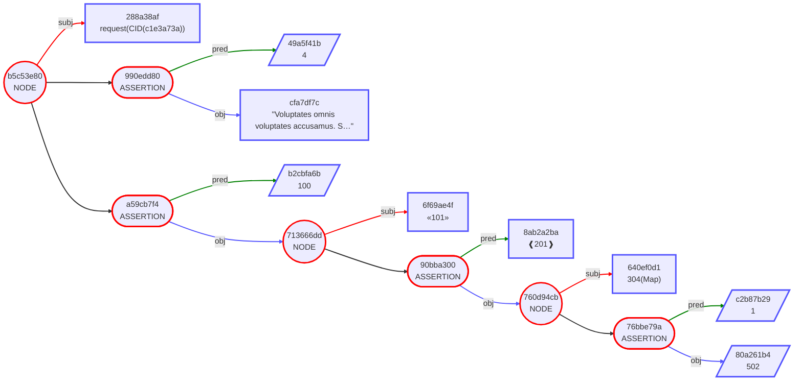

# A Guide to Using UR Envelope Request & Response

STANDARD:
DragonBook:~ ShannonA$ bytewords -i minimal -o hex lftpsptpcsihhsjziniaihtpsptpsolftpsptpcsihjzinjeihjktpsptpcsiaidjlidgegsftfn
82d8c8d81865616c696365d8c8d8c982d8c8d818656c696b6573d8c8d81863626f62
DragonBook:~ ShannonA$ cbor2diag -x 82d8c8d81865616c696365d8c8d8c982d8c8d818656c696b6573d8c8d81863626f62
[200(24("alice")), 200(201([200(24("likes")), 200(24("bob"))]))]

## Request Seed
ur:envelope/lstpsptpcstptktaadethdcxaxtolansehsavteehpwdfxfmveihwewmkgtsmwkksksggtmnvttycpnnynuydmswtpsptpsolftpsptpsgcsietpsplftpsptpcstpttcsietpsptpsolftpsptpcstptdcssptpsptpcstaadeshdcxzmoycylumhmdgwspnyvadaktnsoycwmyaodihgftdllugltphlmtutytadosdwwdtpsptpsolftpsptpsgaatpsptpcsksiefdhsjpkpjncxjtkpjnjskphsjncxieiniajyhscxiejljzjljpihjncxinjtiainiekpjtjycxihkpjnclcxgykpinjkcxjskpinjkcxiejljzjljpihjkcxjkinjycxinjzjzjlcxiajljtjkihjskphsjykpjpcxjkinjycxkojljzkpjojyhsjyihjncxhskpjydmhesrdkts

83d8c8d818d8cfd90138582003ce809c31c2e0345bea433ee465edeb7bd79479c5ca4d8ee0d4229ef6db2ec6d8c8d8c982d8c8d8ca1864d8c882d8c8d818d8d11864d8c8d8c982d8c8d818d8d218c8d8c8d818d901395820ffa11a8b90954fc89ae625779ca11b8f0227573a2f8b4ed85d96ddf901a72cead8c8d8c982d8c8d8ca04d8c8d8187864486172756d206e756d7175616d20646963746120646f6c6f72656d20696e636964756e742065756d212051756973207175697320646f6c6f7265732073697420696c6c6f20636f6e73657175617475722073697420766f6c7570746174656d206175742e

[200(24(207(312(h'03ce809c31c2e0345bea433ee465edeb7bd79479c5ca4d8ee0d4229ef6db2ec6')))), 
 200(201([200(202(100)), 200([200(24(209(100))), 200(201([200(24(210(200))), 200(24(313(h'ffa11a8b90954fc89ae625779ca11b8f0227573a2f8b4ed85d96ddf901a72cea')))]))])])),
200(201([200(202(4)), 200(24("Harum numquam dicta dolorem incidunt eum! Quis quis dolores sit illo consequatur sit voluptatem aut."))]))]

```
83                                      # array(3)
   D8 C8                                # tag(200) ENVELOPE
      D8 18                             # tag(24) BYTE STRING
         D8 CF                          # tag(207)
            D9 0138                     # tag(312)
               58 20                    # bytes(32)
                  03CE809C31C2E0345BEA433EE465EDEB7BD79479C5CA4D8EE0D4229EF6DB2EC6 # "\u0003\u0380\x9C1\xC2\xE04[\xEAC>\xE4e\xED\xEB{הy\xC5\xCAM\x8E\xE0\xD4\"\x9E\xF6\xDB.\xC6"
   D8 C8                                # tag(200) ENVELOPE
      D8 C9                             # tag(201) ASSERTION
         82                             # array(2)
            D8 C8                       # tag(200) ENVELOPE
               D8 CA                    # tag(202) KNOWN VALUE
                  18 64                 # unsigned(100) KV: BODY
            D8 C8                       # tag(200) ENVELOPE
               82                       # array(2)
                  D8 C8                 # tag(200) ENVELOPE
                     D8 18              # tag(24)
                        D8 D1           # tag(209)
                           18 64        # unsigned(100)
                  D8 C8                 # tag(200) ENVELOPE
                     D8 C9              # tag(201)
                        82              # array(2)
                           D8 C8        # tag(200) ENVELOPE
                              D8 18     # tag(24)
                                 D8 D2  # tag(210)
                                    18 C8 # unsigned(200)
                           D8 C8        # tag(200) ENVELOPE
                              D8 18     # tag(24)
                                 D9 0139 # tag(313)
                                    58 20 # bytes(32)
                                       FFA11A8B90954FC89AE625779CA11B8F0227573A2F8B4ED85D96DDF901A72CEA # "\xFF\xA1\u001A\x8B\x90\x95OȚ\xE6%w\x9C\xA1\e\x8F\u0002'W:/\x8BN\xD8]\x96\xDD\xF9\u0001\xA7,\xEA"
   D8 C8                                # tag(200) ENVELOPE
      D8 C9                             # tag(201) ASSERTION
         82                             # array(2)
            D8 C8                       # tag(200) ENVELOPE
               D8 CA                    # tag(202) KNOWN VALUE
                  04                    # unsigned(4) KV: 2
            D8 C8                       # tag(200) ENVELOPE
               D8 18                    # tag(24) BYTE STRING
                  78 64                 # text(100)
                     486172756D206E756D7175616D20646963746120646F6C6F72656D20696E636964756E742065756D212051756973207175697320646F6C6F7265732073697420696C6C6F20636F6E73657175617475722073697420766F6C7570746174656D206175742E # "Harum numquam dicta dolorem incidunt eum! Quis quis dolores sit illo consequatur sit voluptatem aut."
```

```
request(CID(03ce809c)) [
    body: «100» [
        ❰200❱: seed-digest(Bytes(32))
    ]
    note: "Harum numquam dicta dolorem incidunt eum! Quis quis dolores sit illo consequatur sit voluptatem aut."
]
```




[Response Seed]
ur:envelope/lstpsptpcstptktaadethdcxaxtolansehsavteehpwdfxfmveihwewmkgtsmwkksksggtmnvttycpnnynuydmswtpsptpsolftpsptpsgcsietpsplftpsptpcstpttcsietpsptpsolftpsptpcstptdcssptpsptpcstaadeshdcxzmoycylumhmdgwspnyvadaktnsoycwmyaodihgftdllugltphlmtutytadosdwwdtpsptpsolftpsptpsgaatpsptpcsksiefdhsjpkpjncxjtkpjnjskphsjncxieiniajyhscxiejljzjljpihjncxinjtiainiekpjtjycxihkpjnclcxgykpinjkcxjskpinjkcxiejljzjljpihjkcxjkinjycxinjzjzjlcxiajljtjkihjskphsjykpjpcxjkinjycxkojljzkpjojyhsjyihjncxhskpjydmhesrdkts

```
response(CID(03ce809c)) [
    result: Bytes(16) [
        hasName: "Dark Purple Peck Vial"
        id: 200
    ]
]
```



## Request Derivation

ur:envelope/lstpsptpcstptktaadethdcxjkjozepladdliysbjnhnsertmnzolrspfslsroimeszefpfsledagmattaglgyentpsptpsolftpsptpsgcsietpsplftpsptpcstpttcsihtpsptpsolftpsptpcstptdcssotpsplftpsptpcstaaddyoeadlocsdyykaeykaeykaoykaxaatpsptpsolftpsptpsgadtpsptpsgcfadyntpsptpsolftpsptpsgaatpsptpcskspaguinjtjycxjskpincxiejljzjljpinidkpjkcxhsjoihjpinhsjncxkoihjzcxjpihiakpjkhsjtiehsihcxjkinjycxhsjzinhsjkcxhsieinjoinjkiaincxhskpjycxhsjzinjskpiniecxishsjpkpjncxjtjljtdmcxglkpjzjzhscxjkhsihjoihcxjojpjlkoinieihjtjycxinjzjzkpjncxjkinjtjycxhskpjyihjncxkpjycxiajljtjkihjskphsjykpjpcxiykpiohscxjkhsjoinihjtjyihcxjkinjtjycxiajljtjkihiajyihjykpjpcxiejljzjljpihjkfhuyghcedp

```
request(CID(7370feae)) [
    body: «101» [
        ❰201❱: crypto-keypath(Map) [
            id: 502
        ]
    ]
    note: "Sint qui doloribus aperiam vel recusandae sit alias adipisci aut aliquid harum non. Nulla saepe provident illum sint autem ut consequatur fuga sapiente sint consectetur dolores?"
]
```



## Request Key

```
request(CID(c1e3a73a)) [
    body: «101» [
        ❰201❱: crypto-keypath(Map) [
            id: 502
        ]
    ]
    note: "Voluptates omnis voluptates accusamus. Sed aliquam perspiciatis rem veniam commodi harum sequi atque enim est et ab accusantium consequuntur voluptas."
]
```


